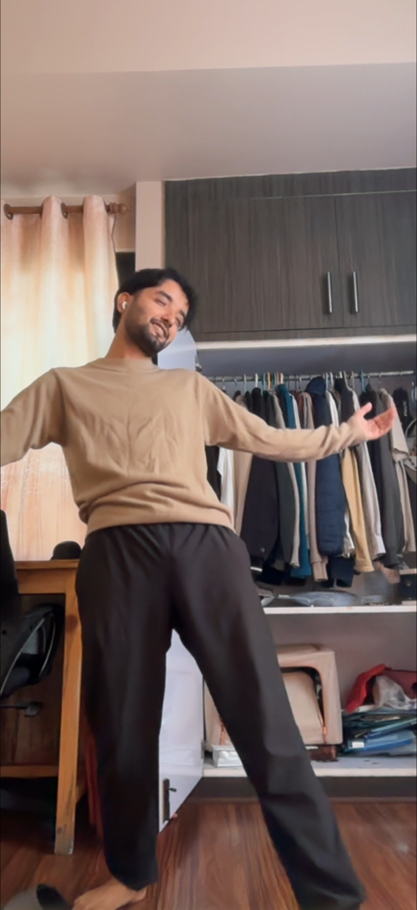
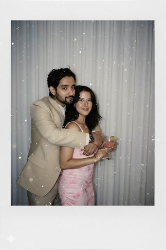

<!doctype html>
<html lang="en">
<head>
<meta charset="utf-8">
<meta name="viewport" content="width=device-width,initial-scale=1,viewport-fit=cover">
<title>💘 Piyush Valentine</title>

</head>

<body>

<!-- ASK SCREEN -->
<section id="ask">

💌 For Piyush

💘 Valentine

<h1>Piyush, will you be my Valentine? 💘</h1>

Choose wisely 😌

<button class="yes" id="yesBtn">Yes 💖</button>
<button class="no" id="noBtn">No 🙅‍♂️</button>

Hint: No is scared

</section>

<!-- YES SCREEN -->
<section id="yes" class="hidden">

✅ Accepted

🥰 Locked in

<h1>YAYYYYY 🥰</h1>

Congratulations Piyush 💕 
You are officially my Valentine.

Love, Reshma 💖

</section>

</body>
</html>
